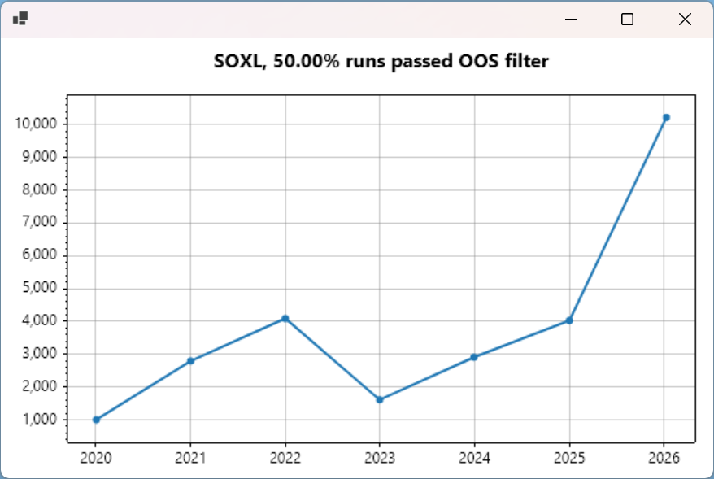
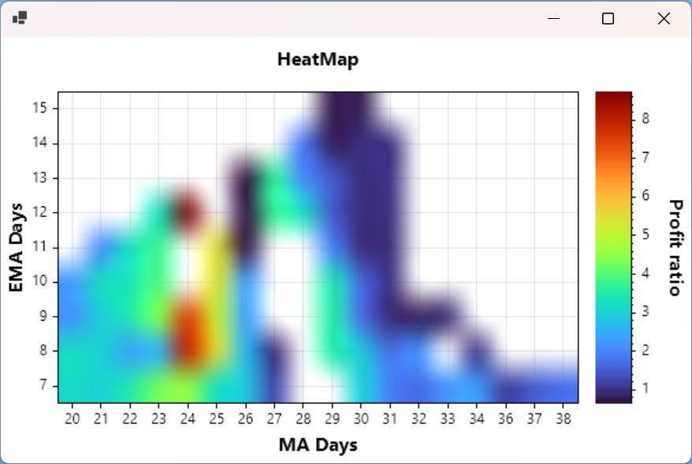

Application for trying, optimizing and testing different investment strategies.

It uses Yahoo Finance or AlphaVantage.NET libraries	to get historical stock data.

Then a developer should implement different strategies (deriving from the Strategy class) in order to optimize and test them.

The application offers testing approaches, which are used by professional traders: Walk-Forward optimization & testing, 
Monte Carlo analysis, Monkey trading (random trades), comparing to just buy-and-hold strategy, etc.

The application also shows an Equity Curve graph and a heatmap of different strategy parameters performance.

### Getting started

The application starts all the optimization and testing for some specific security (ticker) using the Moving Averages Crossover strategy out of the box.  
You can run the application right away and see the testing results.

You can change the security in Program.cs:

```csharp string security = "SOXL";```

To add your own strategy:
1. Create a new class derived from Strategy and implement the required methods.
2. Implement a method similar to WalkForwardTestOnMovingAveragesCrossoverStrategy() in Program.cs
3. Change the call in Main() to your new method.

### Sample output:

Security: **SOXL**  
Initial investment: $1,000.00  
Starting from: 5/22/2014 12:00:00 AM

**Beginning Walk-Forward...**

Optimization from 2016-01 till 2019-12...  
Best strategy: EMA Days = 12, MA Days = 24  
OOS run: $1,000.00 -> $2,790.91, Passed OOS Filter = False

Optimization from 2017-01 till 2020-12...  
Best strategy: EMA Days = 10, MA Days = 21  
OOS run: $2,790.91 -> $4,087.57, Passed OOS Filter = True

Optimization from 2018-01 till 2021-12...  
Best strategy: EMA Days = 9, MA Days = 23  
OOS run: $4,087.57 -> $1,606.36, Passed OOS Filter = False

Optimization from 2019-01 till 2022-12...  
Best strategy: EMA Days = 7, MA Days = 22  
OOS run: $1,606.36 -> $2,906.98, Passed OOS Filter = False

Optimization from 2020-01 till 2023-12...  
Best strategy: EMA Days = 7, MA Days = 22  
OOS run: $2,906.98 -> $4,024.93, Passed OOS Filter = True

Optimization from 2021-01 till 2024-12...  
Best strategy: EMA Days = 9, MA Days = 22  
OOS run: $4,024.93 -> **$10,219.55**, Passed OOS Filter = True

**Buy & Hold:  
$2,930.05**

**Starting monkey tests...**

Monkey test results:

90% of monkey tests with random entry returned below $10,464.43  
90% of monkey tests with random exit returned below $3,861.40  
90% of monkey tests with random entry and exit returned below $8,635.68

Is our strategy better than 90% of monkey test runs with random entry? - False  
Is our strategy better than 90% of monkey test runs with random exit? - True  
Is our strategy better than 90% of monkey test runs with random entry and exit? - True

**Starting Monte Carlo Simulations (2500 permutations)...**

Results:  
OOS Period: January 2020 - December 2020  
Median Drawdown: 68.42%  
Median Profit Ratio: 1.65  
Median Return to Drawdown ratio: 1.09  
Probability of making money: 75.60%

OOS Period: January 2021 - December 2021  
Median Drawdown: 49.87%  
Median Profit Ratio: 2.09  
Median Return to Drawdown ratio: 2.42  
Probability of making money: 99.08%

OOS Period: January 2022 - December 2022  
Median Drawdown: 81.32%  
Median Profit Ratio: 0.36  
Median Return to Drawdown ratio: -0.77  
Probability of making money: 2.72%

OOS Period: January 2023 - December 2023  
Median Drawdown: 38.97%  
Median Profit Ratio: 2.51  
Median Return to Drawdown ratio: 4.46  
Probability of making money: 98.60%

OOS Period: January 2024 - December 2024  
Median Drawdown: 58.09%  
Median Profit Ratio: 0.99  
Median Return to Drawdown ratio: 0.12  
Probability of making money: 38.48%

OOS Period: January 2025 - January 2026  
Median Drawdown: 58.93%  
Median Profit Ratio: 1.93  
Median Return to Drawdown ratio: 1.75  
Probability of making money: 85.00%  


